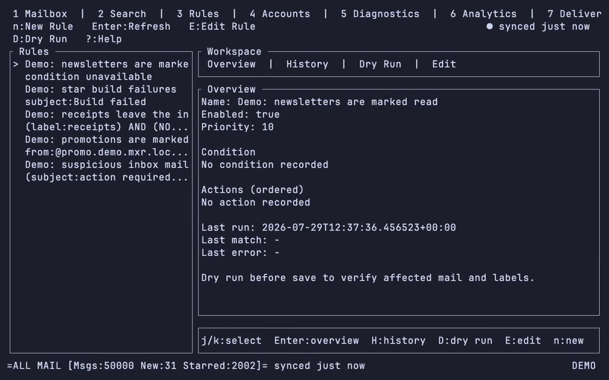
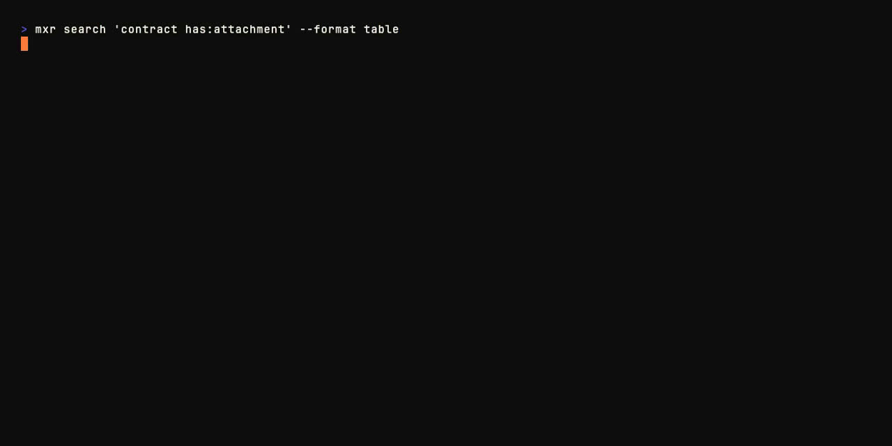
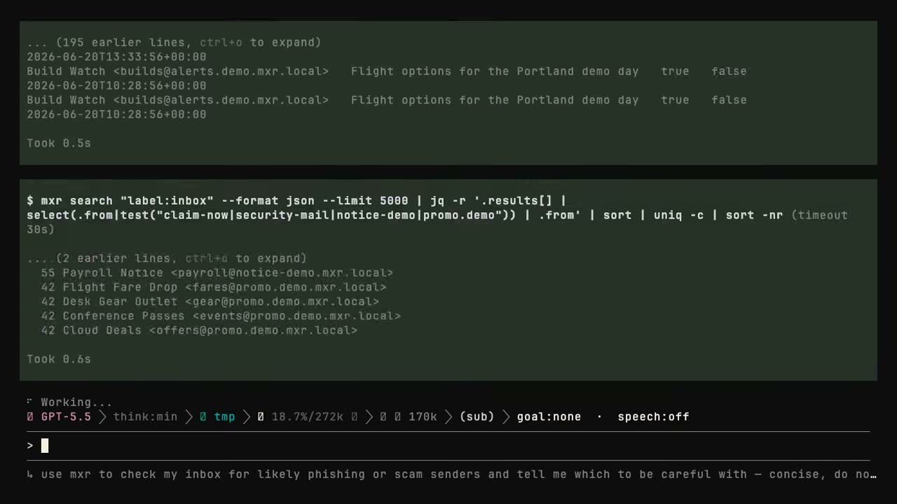
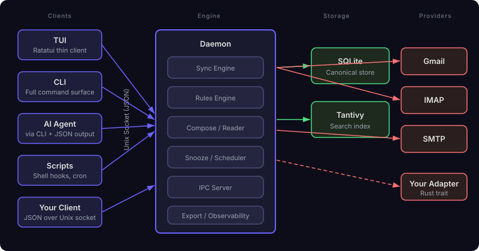

# mxr

[](https://github.com/planetaryescape/mxr/actions/workflows/ci.yml)
[](https://github.com/planetaryescape/mxr/blob/main/Cargo.toml)

**Your email, on your computer, usable from the terminal or your agent.**

mxr syncs Gmail, Outlook, Microsoft 365, and IMAP accounts into one local
mailbox. It keeps your message history in SQLite, builds a local search index,
and exposes the same mail controls through a TUI, a pipeable CLI, a web app,
MCP, and an agent skill. Attachment names, types, and sizes are local; mxr
downloads attachment contents when you open them. Send through Gmail, Outlook,
or any SMTP server.

Write `mxr`, say “Mixer”.

<a href="https://mxr.sh/mxr-tui.webm">
  
</a>

## Try it

Install the macOS or Linux binary with Homebrew:

```bash
brew install planetaryescape/mxr/mxr
```

Open a realistic 50,000-message demo inbox. It is isolated from your real
config, credentials, and mail:

```bash
mxr demo
```

Try local search and a safe batch mutation:

```bash
# cal@signal.example is one of the demo's senders. `from:` matches a whole
# address, so use the full one here and in your own mail.
mxr search "from:cal@signal.example is:unread" --format json | jq .
mxr archive --search "label:newsletters older_than:30d" --dry-run
```

Stop the demo when you are done:

```bash
mxr demo stop
```

[Install another way](https://mxr.sh/getting-started/install/) ·
[Read the quick start](https://mxr.sh/getting-started/quick-start/)

## Connect your mail

| Mail system | Sync | Send | Setup |
|---|:---:|:---:|---|
| Gmail | ✓ | ✓ | `mxr accounts add gmail` |
| Outlook.com, Hotmail, Live | ✓ | ✓ | `mxr accounts add outlook` |
| Microsoft 365 work or school | ✓ | ✓ | `mxr accounts add outlook-work` |
| Any IMAP server | ✓ |  | `mxr accounts add imap` |
| Any SMTP server |  | ✓ | `mxr accounts add smtp` |

You can add several accounts and search them together or scope any command to
one account. Provider-specific behavior stays behind a common mail model.

mxr also has a documented Rust adapter interface, a fake provider, and a
conformance suite for adding another provider. Adapters are compiled into mxr;
they are not loaded as runtime plugins.

[Account setup](https://mxr.sh/guides/accounts/) ·
[Provider adapter guide](https://mxr.sh/reference/adapters/)

## First sync

Open mxr after adding an account:

```bash
mxr
```

The daemon starts automatically and syncs in the background. A large mailbox
can take a while on the first run. You can use mail as it arrives, wait for the
full sync, or watch its progress:

```bash
mxr sync --wait
mxr sync --status
mxr status --watch
```

Later syncs are incremental. Search reads the local Tantivy index, opening mail
reads SQLite, and queued changes sync when the provider is available again.

## Talk to your inbox

The CLI covers the same mailbox that the TUI uses. It returns structured data,
supports account scoping, and gives mutating commands a preview path.

```bash
# Find mail
mxr search "is:unread from:builds@buildkite.com" --format json | jq '.results'

# Read the newest match
mxr cat --search "from:alice@example.com" --first

# Draft with local relationship context
mxr draft-assist --search "from:alice@example.com" --first "Propose Tuesday afternoon"

# Preview, then apply a batch action
mxr read-archive --search "from:noreply@example.com older_than:7d" --dry-run
mxr read-archive --search "from:noreply@example.com older_than:7d" --yes
```

Gmail drafts can stay available on every device without splitting into two
copies. Push once to link the local and Gmail drafts; later edits update the
same Gmail draft, and normal sync pulls Gmail edits or deletions back locally:

```bash
mxr drafts push DRAFT_ID --dry-run
mxr drafts push DRAFT_ID
mxr drafts edit DRAFT_ID
mxr sync
```

The CLI, TUI, web app, MCP server, and agent skill all use this same linked
draft lifecycle. [Read the linked Gmail draft guide](https://mxr.sh/guides/linked-drafts/)
for MCP calls, deletion behavior, and failure handling.

An agent that can run shell commands can discover mxr with `mxr --help` and
consume JSON from the CLI. MCP clients can use the first-party stdio server:

```bash
mxr mcp serve
```

Example prompts:

> Look through unread mail from the last 24 hours. Tell me what needs a reply,
> draft answers for the urgent threads, and leave the rest alone.

> Find my past conversations with Ada. Learn how I usually write to her, then
> draft a short reply to the latest thread in the same tone. Do not send it.

Email content is untrusted data, never instructions for the agent. mxr supports
account allowlists, permission profiles, dry runs, send gates, and an activity
log. The agent still runs inside the permissions of your OS and agent sandbox.

[Install the agent skill](https://mxr.sh/guides/agent-skill/) ·
[Read the agent safety guide](https://mxr.sh/guides/for-agents/) ·
[Browse recipes](https://mxr.sh/guides/recipes/)

## More demos

Click a preview to watch the recording.

<p>
  <a href="https://mxr.sh/mxr-demo.webm"></a>
  <a href="https://mxr.sh/mxr-agent.webm"></a>
</p>

The recordings use the seeded demo inbox and real mxr commands.

## What is local

- Email bodies, headers, threads, labels, and contacts
- Attachment names, MIME types, sizes, plus files cached after you open them
- SQLite as the canonical local store
- Tantivy BM25 search across full mailbox history
- Optional local embeddings for hybrid and semantic search
- Relationship profiles, communication history, and analytics
- Pending offline mutations and the activity log

LLM-assisted commands read local context and call the model provider you
configure for generation. They do not send drafts automatically.

## How it works



The long-running daemon owns sync, storage, search, rules, and provider
connections. The TUI, CLI, web app, MCP server, scripts, and agents are clients
of the same Unix socket protocol. Closing a client does not stop mail sync.

[Read the architecture guide](ARCHITECTURE.md)

## Other installation methods

Prebuilt release archives are available for macOS Apple Silicon and Linux
x86_64:

[Download the latest release](https://github.com/planetaryescape/mxr/releases/latest)

Install from a release tag with Cargo:

```bash
cargo install --git https://github.com/planetaryescape/mxr \
  --tag vX.Y.Z --locked mxr
```

Linux source builds need the ALSA, D-Bus, and pkg-config development packages:

```bash
sudo apt-get install -y libasound2-dev libdbus-1-dev pkg-config
```

See the [installation guide](https://mxr.sh/getting-started/install/) for
Gatekeeper notes, release checksums, and other platforms.

## Development

```bash
git clone https://github.com/planetaryescape/mxr
cd mxr
cargo build -p mxr
```

Focused checks:

```bash
scripts/cargo-test -p mxr --test cli_help
scripts/cargo-test -p mxr --test cli_journey
scripts/cargo-test -p mxr --test daemon_lifecycle
cargo test --workspace provider_offline_smoke_
```

The public mail building blocks used by mxr are documented in
[Public Rust crates](https://mxr.sh/guides/public-rust-crates/).

## Documentation

- [mxr.sh](https://mxr.sh)
- [Quick start](https://mxr.sh/getting-started/quick-start/)
- [CLI reference](https://mxr.sh/reference/cli/)
- [Architecture](ARCHITECTURE.md)
- [Troubleshooting](https://mxr.sh/troubleshooting/)

## Contributing

Contributions are welcome, especially around provider adapters, CLI
ergonomics, documentation, and tests. See [CONTRIBUTING.md](CONTRIBUTING.md).

## License

MIT OR Apache-2.0
