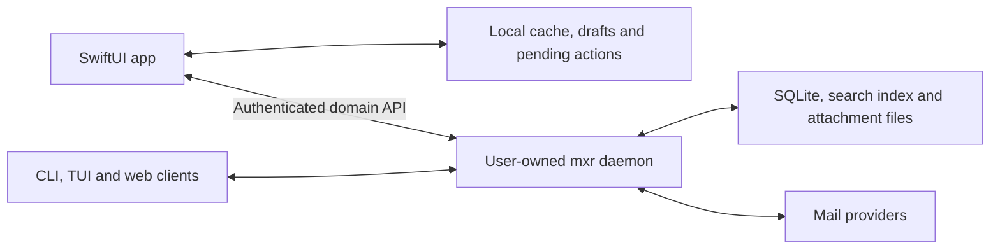

# A native iOS client should share the daemon's workspace

Research recommendation, 2026-10-10. This is not an accepted architecture decision or implementation commitment. Repository evidence is pinned to freshly fetched `origin/main`, commit [`80606f4833b651bf9b07975ddd49083d7cb2568a`](https://github.com/planetaryescape/mxr/tree/80606f4833b651bf9b07975ddd49083d7cb2568a); the research worktree matches that commit. External documentation was checked on the same date.

BK has since confirmed that a phone app which reads downloaded mail and prepares replies, synchronizing only when the laptop is reachable on the same network, is an acceptable compromise. He also proposed moving the daemon to his Hostinger VPS. Independent provider access from the phone is therefore not a first-release requirement. Queued-send behavior below is a recommendation; host choice and the exact offline action set remain undecided.

The next request is preparation that benefits mxr even without either deployment. The [daemon portability blueprint](../blueprint/23-daemon-portability.md) now owns the proposed sequence: current reliability fixes, durable drafts and operations, portable resources, API contracts, client targeting and tested recovery. It supersedes the app spike as the immediate next work.

## Keep one mxr workspace and give it a native phone client

Build a SwiftUI app that talks to the mxr daemon through a supported, authenticated network API. Give the phone a local SQLite cache, durable drafts and pending actions, and explicit reconciliation with daemon state. Use the web app to learn the product's information architecture and workflows; design navigation, reading and composing for iOS.

The recommendation assumes “mxr on my phone” means access to the same classifications, modes, rules, to-dos, reading progress and automation outcomes. That is the architectural reason for keeping one authority. The [documented daemon-first contract](https://github.com/planetaryescape/mxr/blob/80606f4833b651bf9b07975ddd49083d7cb2568a/docs/vision.md#L70-L86) places durable workflows behind IPC and rejects separate client-owned versions of them.

The daemon can run on the Mac initially. Dependable mobile availability would call for an always-on, user-owned host; that need not be the laptop. Host selection and deployment support still require validation. No cloud database is mandatory, and Rust need not run on the phone solely to make HTTP requests. Keep Rust's existing domain behavior in the daemon; Swift owns presentation, local caching and iOS lifecycle integration.

This preserves data ownership and offline access, but limits device independence. With the daemon unreachable, the phone can read downloaded content and retain drafts or eligible pending actions. It cannot fetch uncached mail, run the daemon's search, complete provider actions or execute its automations. A laptop-dependent companion should not be presented as a standalone email replacement.

## The laptop and a personal VPS can run the same daemon

Use one active daemon for the workspace, with its SQLite database, search index, attachments, provider credentials and automation state on that host. The phone owns downloaded content, local drafts and a durable queue of intended actions. A personal VPS is a deployment of this architecture; it does not require a shared cloud database or a multi-tenant service.

| Behavior | Daemon on the laptop | Daemon on the VPS |
| --- | --- | --- |
| Fresh mail and confirmed sends | When the laptop is awake, running mxr and reachable | When the phone can reach the running VPS |
| Downloaded reading and drafting | Available offline | Available offline |
| Provider synchronization and automation | Continue while the laptop daemon runs, even if the phone is away | Continue while the VPS daemon runs, even if both clients are off |
| Main ongoing obligation | Laptop availability | Server operation, backups and credentials stored on a hosted machine |

For the first validation, keep the working daemon on the laptop and build the native read/reply workflow against a supported remote API. If the VPS becomes the chosen home, migrate the workspace and switch clients to it, retiring the old daemon as an automation owner. Avoid running two independent automation owners against the same accounts as a substitute for migration. The common client contract makes this a deployment decision; moving data, credentials and host-dependent services still requires work.

For LAN use, discover a paired host with Bonjour or accept its configured address, then authenticate the daemon and device. Network membership is not authentication. [Apple requires local-network usage declarations and Bonjour service declarations where applicable](https://developer.apple.com/documentation/technotes/tn3179-understanding-local-network-privacy). Refresh on launch, foreground resume and explicit refresh. Joining the same Wi-Fi does not guarantee background execution; [Apple's background limits](https://developer.apple.com/forums/thread/685525) mean the reliable promise is synchronization while the app is active and the daemon is reachable. Background refresh can improve this opportunistically.

Offline replies remain in a local outbox until transferred. Distinguish waiting on the phone, accepted by the daemon, provider-confirmed send, failure and uncertain outcome. Once the daemon durably accepts responsibility, it can finish without the phone connection. A lost response must reconcile through the operation receipt; an uncertain provider outcome must not trigger blind resend. This is a proposed contract, not a claim about the current compose API.

## Extend HTTPS and JSON before adding another transport

Use versioned HTTPS requests with JSON for reads, mutations and compose, and byte-transfer resources for attachments. Add an authenticated WebSocket for live change hints while connected; correctness must come from refresh/reconciliation after reconnection, not from receiving every event. Native Swift supports this through URLSession, including [URLSessionWebSocketTask](https://developer.apple.com/documentation/foundation/urlsessionwebsockettask).

gRPC and Protocol Buffers would add another contract and toolchain without resolving the current mobile gaps: remote authentication, portable resources, cache reconciliation and retry semantics. Keep them out of the first implementation unless a measured requirement favors them. Keep request handling thin and route behavior through the same daemon operations used by the CLI. Rust can stay on the host for this client design.

## The VPS is plausible, but current desktop clients are not all remote-ready

At `origin/main@80606f4`, the [release matrix includes x86_64 Linux](https://github.com/planetaryescape/mxr/blob/80606f4833b651bf9b07975ddd49083d7cb2568a/.github/workflows/release.yml#L44-L51). [Password-backed accounts can use disk-only credential resolution](https://github.com/planetaryescape/mxr/blob/80606f4833b651bf9b07975ddd49083d7cb2568a/crates/daemon/src/provider_credentials.rs#L3-L11), and [Gmail token persistence falls back to disk](https://github.com/planetaryescape/mxr/blob/80606f4833b651bf9b07975ddd49083d7cb2568a/crates/provider-gmail/src/auth_storage.rs#L99-L118). These are useful foundations for a headless host; they do not validate BK's specific VPS or account setup.

The [CLI connector already accepts an SSH command transport](https://github.com/planetaryescape/mxr/blob/80606f4833b651bf9b07975ddd49083d7cb2568a/crates/daemon/src/server.rs#L511-L526). The [TUI connection still takes a Unix socket](https://github.com/planetaryescape/mxr/blob/80606f4833b651bf9b07975ddd49083d7cb2568a/crates/tui/src/client.rs#L15-L29), and the [remote command documentation explicitly calls out compose and attachment path limitations](https://github.com/planetaryescape/mxr/blob/80606f4833b651bf9b07975ddd49083d7cb2568a/crates/daemon/src/cli/mod.rs#L38-L48). Moving the daemon therefore needs verification of BK's actual Mac workflows, not just a phone endpoint. Local CLI IPC can stay; a common domain surface does not require rewriting every client onto HTTP immediately.

A VPS deployment also needs a deliberate model endpoint. The [LLM configuration defaults to a localhost URL and supports per-feature overrides](https://github.com/planetaryescape/mxr/blob/80606f4833b651bf9b07975ddd49083d7cb2568a/crates/config/src/types.rs#L327-L381). An endpoint on the laptop would retain that feature's laptop dependency. CPU, memory, disk, account authorization, selected model execution and backup/restore must be checked on the actual host before proposing a production move. No Hostinger instance has been inspected or changed.

The VPS puts the authoritative mailbox and provider credentials on hosted infrastructure. That preserves a user-controlled workspace but changes device-local storage and offline availability for desktop clients. The phone cache does not automatically give the existing Mac clients an offline cache. Activity data remains local to its originating runtime and is excluded from the proposed phone synchronization surface.

## The alternatives solve different product requirements

| Approach | What it provides | Continuing cost and limitation | Assessment |
| --- | --- | --- | --- |
| SwiftUI with an offline cache, calling the daemon | One coherent workspace and one automation authority; useful downloaded content offline | Remote access, cache reconciliation, durable command receipts and host availability | Recommended under the shared-workspace assumption |
| SwiftUI embedding a portable Rust engine, syncing directly with providers | Basic mail works while every mxr host is off; strongest device independence | Mobile engine extraction, lifecycle adaptation and explicit synchronization of mxr-specific state and automation ownership | Prefer if independence is a requirement |
| Mac daemon publishing state to a cloud database, with phone commands flowing back | Published content remains accessible even when it was never cached on the phone; cloud can accept commands while the Mac sleeps | Another durable store, replication contract and command protocol; processing still waits for the daemon | Viable, but availability benefit must justify the added system |
| Daemon offered as a hosted service with a native client | Removes the user's always-on-host responsibility and centralizes workspace execution | Operating a mail service, credentials, tenancy, privacy and service availability become product obligations | A separate hosted-product decision |

Full-database replication is the wrong default boundary for this application, not a universally wrong technology. A carefully designed published dataset could be useful later. The original proposal improves access to already-published data; it does not make the Mac's execution available while the Mac is asleep.

Turso's [embedded replicas](https://docs.turso.tech/features/embedded-replicas/introduction) serve local reads and forward writes to the cloud primary by default. The newer [Turso Sync](https://docs.turso.tech/sync/usage) supports local writes with explicit push/pull and [last-push-wins conflict resolution](https://docs.turso.tech/sync/conflict-resolution). Those mechanisms synchronize data; mxr would still own application conflicts, command outcomes and automation execution. Moving to them also requires an integration with the current SQLx store. This is a fit assessment, not a finding that Turso cannot support the design.

An independent engine is technically credible. [Delta Chat's iOS app](https://github.com/deltachat/deltachat-ios) integrates a [shared Rust mail core](https://github.com/chatmail/core), and its [multi-device documentation](https://delta.chat/en/help#multiclient) describes independent operation after pairing. That demonstrates feasibility, not compatibility with mxr's workflow model. Provider synchronization covers provider state; mxr's extra state still needs its own protocol. Shared code avoids rewriting behavior, but multiple instances still need rules for conflicting changes and duplicate automation.

## The current code supports a domain API boundary

The bridge already exposes [mailbox, search, thread, mutation and compose routes](https://github.com/planetaryescape/mxr/blob/80606f4833b651bf9b07975ddd49083d7cb2568a/crates/web/src/router.rs#L87-L147). Its [IPC adapter](https://github.com/planetaryescape/mxr/blob/80606f4833b651bf9b07975ddd49083d7cb2568a/crates/web/src/lib.rs#L2040-L2059) forwards domain requests to the daemon. This is a useful starting boundary, although several route contracts still assume the same machine.

“Done” shows why direct database writes would be misleading. The handler [validates the operation and builds its plan](https://github.com/planetaryescape/mxr/blob/80606f4833b651bf9b07975ddd49083d7cb2568a/crates/daemon/src/handler/mode_done.rs#L117-L146), considers [remaining modes and open to-dos before selecting mail to archive](https://github.com/planetaryescape/mxr/blob/80606f4833b651bf9b07975ddd49083d7cb2568a/crates/daemon/src/handler/mode_done.rs#L332-L387), then [performs provider mutations and records successful workflow changes](https://github.com/planetaryescape/mxr/blob/80606f4833b651bf9b07975ddd49083d7cb2568a/crates/daemon/src/handler/mode_done.rs#L420-L508). Updating a replicated row would not execute that contract.

SQLite also does not contain the whole runtime. The daemon's [AppState](https://github.com/planetaryescape/mxr/blob/80606f4833b651bf9b07975ddd49083d7cb2568a/crates/daemon/src/state.rs#L408-L457) holds sync, search, semantic, relationship, provider and event services. The store uses [SQLx SQLite pools](https://github.com/planetaryescape/mxr/blob/80606f4833b651bf9b07975ddd49083d7cb2568a/crates/store/src/pool.rs#L32-L73); search opens a [separate Tantivy directory](https://github.com/planetaryescape/mxr/blob/80606f4833b651bf9b07975ddd49083d7cb2568a/crates/search/src/index.rs#L136-L150). Replicating SQL does not transfer those services or files.

An embedded engine would need a deliberate library boundary. The [root package](https://github.com/planetaryescape/mxr/blob/80606f4833b651bf9b07975ddd49083d7cb2568a/Cargo.toml#L1-L39) and [library entry point](https://github.com/planetaryescape/mxr/blob/80606f4833b651bf9b07975ddd49083d7cb2568a/crates/daemon/src/lib.rs#L9-L44) combine daemon and CLI responsibilities. They are not evidence of a ready mobile SDK.

## Remote access and offline reconciliation need real contracts

The bridge [rejects non-loopback binds](https://github.com/planetaryescape/mxr/blob/80606f4833b651bf9b07975ddd49083d7cb2568a/crates/daemon/src/bridge.rs#L121-L130). A supported remote gateway needs encrypted transport, device pairing, revocation and an appropriate exposed API surface. Its [local-token handshake](https://github.com/planetaryescape/mxr/blob/80606f4833b651bf9b07975ddd49083d7cb2568a/crates/web/src/router.rs#L59-L85) trusts the TCP peer's loopback address. A proxy connecting locally would satisfy that test for forwarded requests: disable the handshake on a remote gateway rather than treating proxy locality as user locality.

The [WebSocket loop](https://github.com/planetaryescape/mxr/blob/80606f4833b651bf9b07975ddd49083d7cb2568a/crates/web/src/lib.rs#L2097-L2158) forwards live events without a replay cursor. Start with authoritative snapshot refreshes on reconnect; add durable change cursors when the measured cache size warrants them. An API does not make synchronization free: define cache coverage, deletion reconciliation, schema upgrades and stale-result handling explicitly.

[JMAP's change protocol](https://www.rfc-editor.org/rfc/rfc8620.html#section-5.2) is a useful reference for created, updated and destroyed IDs, state tokens and cache reset when history expires. Borrow those semantics if incremental sync becomes necessary; implementing JMAP wholesale is not a prerequisite. [Tailscale Serve](https://tailscale.com/docs/features/tailscale-serve) is a candidate private HTTPS transport for a personal deployment after the gateway's authentication boundary is ready. Neither is configured or tested here.

Retry safety also needs extending. mxr has a [24-hour mutation deduplication store](https://github.com/planetaryescape/mxr/blob/80606f4833b651bf9b07975ddd49083d7cb2568a/crates/store/src/mutation_dedup.rs#L15-L35), while [each mutation invocation generates a new mutation ID](https://github.com/planetaryescape/mxr/blob/80606f4833b651bf9b07975ddd49083d7cb2568a/crates/daemon/src/handler/mutations.rs#L528-L551). A mobile retry after a lost response needs a stable client operation ID and a durable receipt. Define expiry and ambiguous outcomes, especially for sends. Preserve preview requirements; changed selection or consequences must trigger review rather than silently applying an old preview.

The preparation audit found a useful distinction: [stored sends already reuse receipts by draft ID](https://github.com/planetaryescape/mxr/blob/80606f4833b651bf9b07975ddd49083d7cb2568a/crates/daemon/src/handler/mutations.rs#L3177-L3194), but [web compose creates a fresh draft ID on each send](https://github.com/planetaryescape/mxr/blob/80606f4833b651bf9b07975ddd49083d7cb2568a/crates/web/src/lib.rs#L851-L865). Preserve stable draft identity and edit revisions through that boundary instead of adding a separate send-receipt system.

Compose and attachments need portable identities. [Compose refresh accepts a host draft path](https://github.com/planetaryescape/mxr/blob/80606f4833b651bf9b07975ddd49083d7cb2568a/crates/web/src/lib.rs#L696-L704), and [attachment download returns an AttachmentFile](https://github.com/planetaryescape/mxr/blob/80606f4833b651bf9b07975ddd49083d7cb2568a/crates/web/src/lib.rs#L1468-L1486) containing a [filesystem path](https://github.com/planetaryescape/mxr/blob/80606f4833b651bf9b07975ddd49083d7cb2568a/crates/protocol/src/types.rs#L4075-L4081). Use draft IDs and byte-transfer endpoints for the phone.

[Apple's Swift OpenAPI Generator](https://github.com/apple/swift-openapi-generator) could generate the network client. First complete the relevant route schemas: mxr's [OpenAPI declaration](https://github.com/planetaryescape/mxr/blob/80606f4833b651bf9b07975ddd49083d7cb2568a/crates/web/src/openapi.rs#L17-L24) explicitly describes an incomplete inventory without per-route parameters or response bodies.

## iOS makes notifications a separate service concern

[Apple's execution limits](https://developer.apple.com/forums/thread/685525), updated in January 2026, still prohibit a general-purpose continuous background daemon. Background refresh is discretionary. [Continued processing](https://developer.apple.com/documentation/BackgroundTasks/performing-long-running-tasks-on-ios-and-ipados) can finish user-initiated foreground work, but does not provide continuous mailbox monitoring.

[Background pushes](https://developer.apple.com/documentation/usernotifications/pushing-background-updates-to-your-app) can be delayed, throttled or discarded. Reconcile on launch and resume regardless of notifications. Timely new-mail alerts need an external observer and APNs delivery; that observer could be the daemon. Gmail's [push interface](https://developers.google.com/workspace/gmail/api/guides/push) delivers through Cloud Pub/Sub and requires watch renewal, so it is not a direct iOS wake mechanism.

Rust remains an option for an independent app: [device and simulator targets exist](https://doc.rust-lang.org/rustc/platform-support/apple-ios.html), and [UniFFI generates Swift bindings](https://mozilla.github.io/uniffi-rs/latest/swift/overview.html). Its current Swift 6 support is partial, and [cancellation requires library-specific handling](https://mozilla.github.io/uniffi-rs/latest/futures.html#cancelling-async-code). Dependency portability, background cancellation and database lifecycle would require a device spike.

## Validate one workflow before committing to the architecture

The proposed completion check is concrete: on an iPhone, open a test thread, read its cached body in airplane mode, prepare a reply and retain it across app termination. Reconnect, submit through the daemon, and observe the confirmed send and updated thread in the CLI. Include a lost-response retry, an uncertain provider response and a desktop change made while the phone was offline. A changed preview must remain pending for review; an uncertain send must not be blindly repeated.

Use isolated test data and a scoped authenticated gateway. Complete only the schemas, snapshot, basic reply and operation-receipt behavior that this slice needs. Keep notifications, rich compose and attachment transfer outside its acceptance criteria. Measure refresh latency and cached-data coverage before choosing incremental synchronization machinery.

This research verified source and first-party documentation. It did not compile an iOS target, test remote access, measure battery use or validate an always-on deployment. No application behavior changed. The independence requirement is now settled for the initial scope: a reachable daemon is acceptable. The next implementation step is daemon preparation under [blueprint 23](../blueprint/23-daemon-portability.md), starting with durable draft identity or its independent reliability fixes. The native read/reply validation slice follows that preparation when an iOS build is requested. VPS adoption additionally requires inspecting the actual host and validating the Mac client workflows. This note is the handover and its links are the evidence.

BK's second opinion was completed through a fresh, restricted OpenCode 1.18.35 session using Claude Opus 5.5 with maximum effort. The reviewer read only an isolated probe and had file-read/search permissions, with external-directory access and external plugins disabled. [Routing evidence](../build-log/daemon-portability/evidence/verifier-routing.json) records the requested and reported model, permissions, and successful probe. No global configuration or saved credentials were changed.

Unresolved decisions:

- Should the first usable release retain the laptop daemon, or move the workspace to the VPS?
- Which Mac client workflows must remain available if the daemon moves?
- Which content must be available offline, and which actions may remain pending?
- Are new-mail push notifications required for the first usable release?
